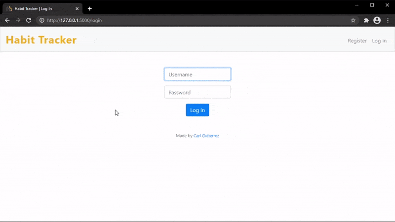

# Habit Tracker

**Environment:** Flask, Jinja, Bootstrap & JavaScript

## About

A simple habit tracker that tracks your new habit progress and reset if a habit passed the maximum day off.



To run it:

```
pip install -r requirements.txt
flask run
```

### Resources

Chart is from [Koolchart](https://www.koolchart.com/demo/target-chart).
